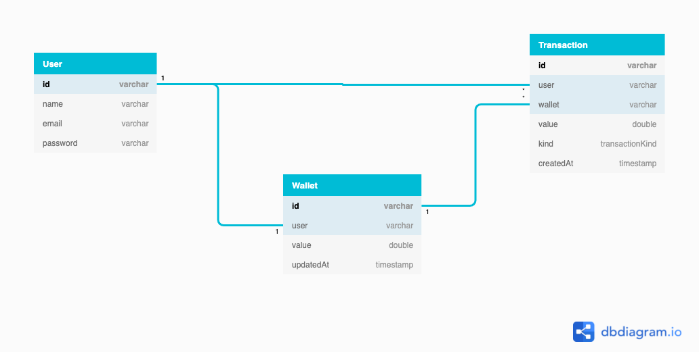
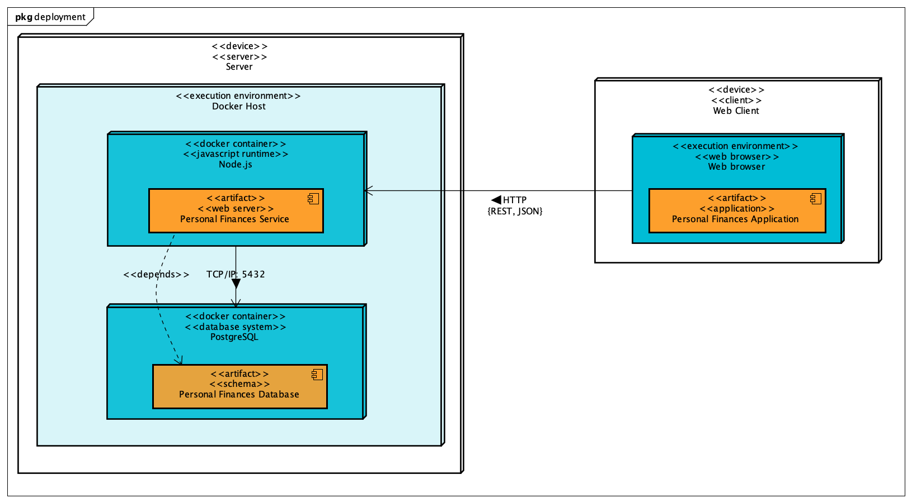

<h1 align="center">Personal Finances</h1>

Have control over your personal cash flow

    
    
    

Summary
=================
<!--ts-->
   * [About](#about)
   * [User stories](#user-stories)
      * [Transactions](#transactions)
      * [Account](#account)
   * [Design](#design)
      * [Entity Relationship Diagram](#entity-relationship-diagram)
      * [Deployment Diagram](#deployment-diagram)
   * [How to use](#how-to-use)
      * [Requirements](#requirements)
      * [Instalation](#instalation)
      * [Running](#running)
   * [Tests](#tests)
   * [Stack](#stack)
<!--te-->

## About

## User stories

### Persona
- **Carlos**: Carlos is 21 years old, studies Software Engineering and has been working as a Software Developer for 2 years.
He wants to travel to the beach by the end of the year but does not have money for this.
Carlos wants to understand how he spend his money, so he can cut unnecessary expenses.

### Transactions
- [ ] As Carlos, I want to save my transactions (in/out), so I can figure out my expenses.
- [x] As Carlos, I want to see my current balance, so I can know if I can spend more money or not.
- [ ] As Carlos, I want to be able to analyze my expenses (out transactions), so I can see how I usually spend my money.
- [ ] As Carlos, I want to save my transactions as a file, so I can declare my income tax (imposto de renda) when needed. 

### Account
- [ ] As Carlos, I want to create my personal account, so I can manage my money.
- [ ] As Carlos, I want to authenticate in my personal account, so I can manage my money.
- [ ] As Carlos, I want to reset my account password, so I can access my account if I forget it.

## Design

### Entity Relationship Diagram

### Deployment Diagram

## How to use

### Requirements

### Instalation

### Running

## Tests

## Stack
