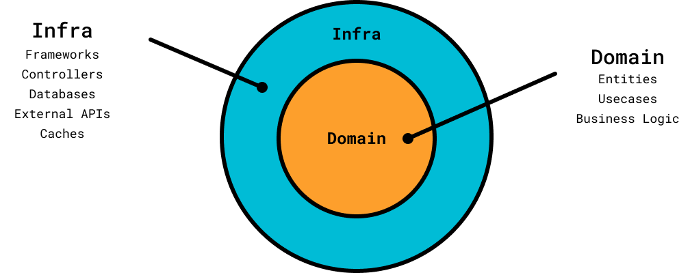
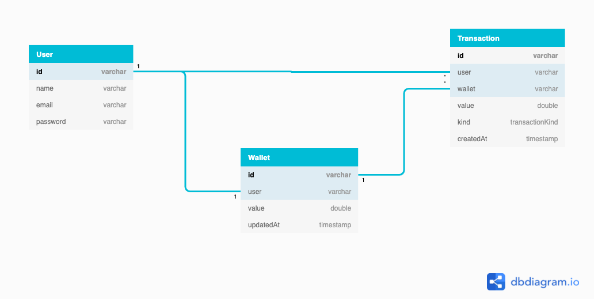
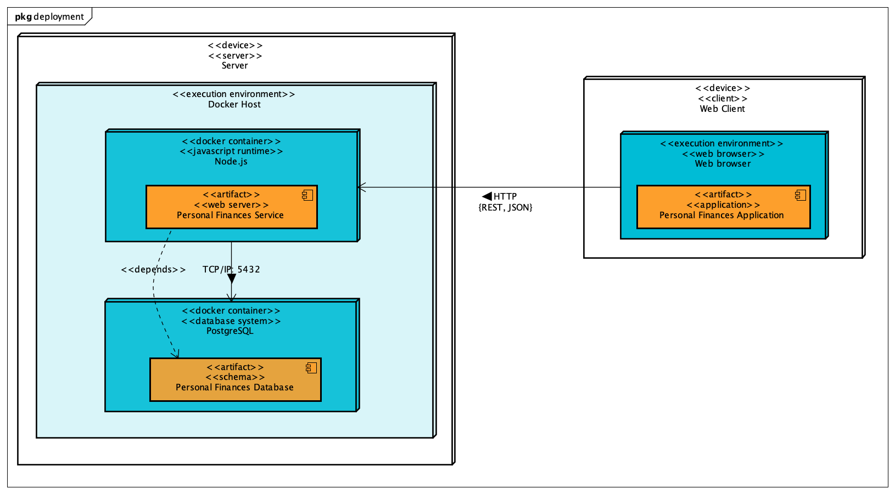

<h1 align="center">Personal Finances</h1>
<p align="center">Have control over your personal cash flow</p>

<p align="center">
    <a href="https://github.com/EduardoGiacomini">
        
    </a>
    <a href="https://github.com/EduardoGiacomini/personal-finances-service/stargazers">
        
    </a>
    
</p>

Summary
=================
<!--ts-->
   * [About](#about)
   * [User cases](#user-cases)
      * [Transactions](#transactions)
      * [Account](#account)
   * [Design](#design)
      * [Entity Relationship Diagram](#entity-relationship-diagram)
      * [Deployment Diagram](#deployment-diagram)
   * [How to use](#how-to-use)
      * [Requirements](#requirements)
      * [Instalation](#instalation)
      * [Running](#running)
   * [Tests](#tests)
   * [Stack](#stack)
<!--te-->

## About

## User cases
The full use cases documentation is in [/docs/usecases](docs/usecases/README.md). Please, read the use cases to know 
more about the application domain.

## Design

### Architecture
For this project I am using a Layered Architecture based on the article [Descomplicando a Clean Architecture, Guilherme Biff Zarelli
](https://medium.com/luizalabs/descomplicando-a-clean-architecture-cf4dfc4a1ac6), Ports and Adapters and Clean Architecture:



The main proposal of this architecture is separate the domain code (entities, use cases and business logic) from 
infrastructure code (frameworks, controllers, databases, external APIs and caches).

With this idea we can implement our domain rules independently of infrastructure by creating abstractions (ports) 
on the domain layer and providing different implementations (adapters) on infrastructure layer.

In this way, our code becomes:
- Flexible: We can provide different implementations to the domain, so we can easily change our database, orm, 
  frameworks;
- Testable: We can create mocks and stubs for the domain dependencies (implementing their interfaces);
- Follow the SOLID principles: As our domain code depends on abstractions, we are following at least the Dependency 
  Inversion Principle.

### Database Schema
For the storage I am using a relational database (Postgres). You can check the database schema on the following Entity 
Relationship Diagram:


### Deployment Diagram


## How to use

### Requirements

- [Node.js](https://nodejs.org/en/) *(v16 LTS is recommended)*;
- [Docker](https://www.docker.com/);
- [docker-compose](https://docs.docker.com/compose/).

### Running

#### Development
```bash
# create the environment file
cp .env.example .env

# edit the .env file with your configuration

# start the mongodb with docker
docker-compose -f docker-compose.dev.yaml up --build

# install dependencies
yarn

# run the service
yarn start:dev
```

#### Production
```bash
# create the environment file
cp .env.example .env

# edit the .env file with your configuration

# create the docker network
docker network create personal-finances-network

# start the mongodb and service with docker
docker-compose up --build
```

#### Tests
```bash
# install dependencies
yarn

# run tests
yarn test
```

#### Lint
```bash
# install dependencies
yarn

# run lint
yarn lint
```

## Tests


## Stack
