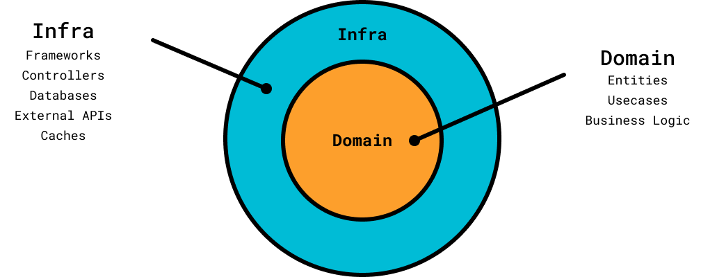

<h1 align="center">Personal Finances</h1>

Have control over your personal cash flow

    
    
    

Summary
=================
<!--ts-->
   * [About](#about)
   * [User stories](#user-stories)
      * [Transactions](#transactions)
      * [Account](#account)
   * [Design](#design)
      * [Entity Relationship Diagram](#entity-relationship-diagram)
      * [Deployment Diagram](#deployment-diagram)
   * [How to use](#how-to-use)
      * [Requirements](#requirements)
      * [Instalation](#instalation)
      * [Running](#running)
   * [Tests](#tests)
   * [Stack](#stack)
<!--te-->

## About

## User stories

### Persona
- **Carlos**: Carlos is 21 years old, studies Software Engineering and has been working as a Software Developer for 2 years.
He wants to travel to the beach by the end of the year but does not have money for this.
Carlos wants to understand how he spend his money, so he can cut unnecessary expenses.

### Transactions
- [ ] As Carlos, I want to save my transactions (in/out), so I can figure out my expenses.
- [x] As Carlos, I want to see my current balance, so I can know if I can spend more money or not.
- [ ] As Carlos, I want to be able to analyze my expenses (out transactions), so I can see how I usually spend my money.
- [ ] As Carlos, I want to save my transactions as a file, so I can declare my income tax (imposto de renda) when needed. 

### Account
- [ ] As Carlos, I want to create my personal account, so I can manage my money.
- [ ] As Carlos, I want to authenticate in my personal account, so I can manage my money.
- [ ] As Carlos, I want to reset my account password, so I can access my account if I forget it.

## Design

### Architecture
For this project I am using a Layered Architecture based on the article [Descomplicando a Clean Architecture, Guilherme Biff Zarelli
](https://medium.com/luizalabs/descomplicando-a-clean-architecture-cf4dfc4a1ac6), Ports and Adapters and Clean Architecture:

The main proposal of this architecture is separate the domain code (entities, use cases and business logic) from infrastructure code (frameworks, controllers, databases, external APIs and caches).

With this idea we can implement our domain rules independently of infrastructure by creating abstractions (ports) on the domain layer and providing different implementations (adapters) on infrastructure layer.

In this way, our code becomes:
- Flexible: We can provide different implementations to the domain, so we can easily change our database, orm, frameworks;
- Testable: We can create mocks and stubs for the domain dependencies (implementing their interfaces);
- Follow the SOLID principles: As our domain code depends on abstractions, we are following at least the Dependency Inversion Principle.

### Database Schema
For the storage I am using a relational database (Postgres). You can check the database schema on the following Entity Relationship Diagram:

### Deployment Diagram

## How to use

### Requirements

### Instalation

### Running

## Tests

## Stack
